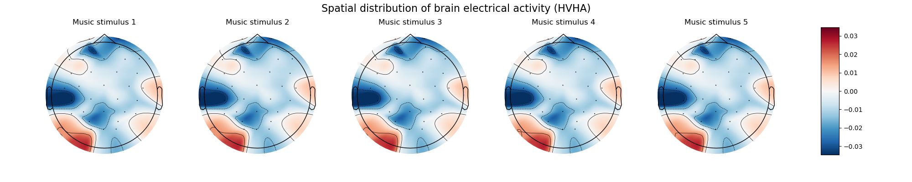
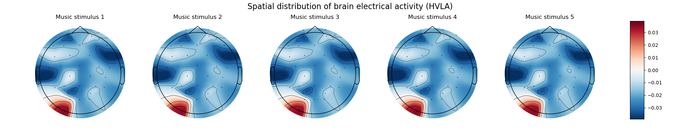
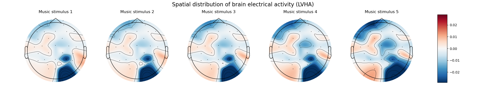
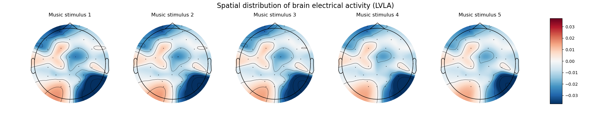

# Visualization

The visualization results of the EEG signals in MEEG dataset are shown in this section.

## Results

### HVHA

The EEG signals of HVHA emotion are visualized in the following figure.



### HVLA

The EEG signals of HVLA are visualized in the following figure.



### LVHA

The EEG signals of LVHA are visualized in the following figure.



### LVLA

The EEG signals of LVLA are visualized in the following figure.



## Reproduce

You can reproduce the visualization results by running the following command.

```bash
cd ../example
```

```bash
python visualization.py
```
